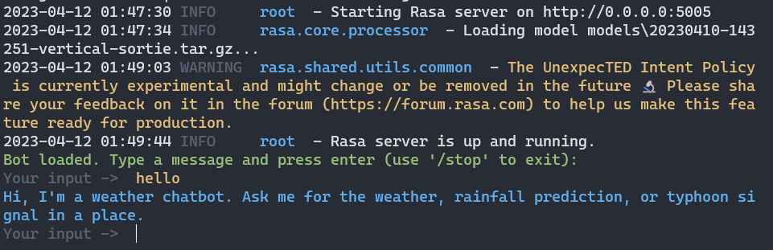
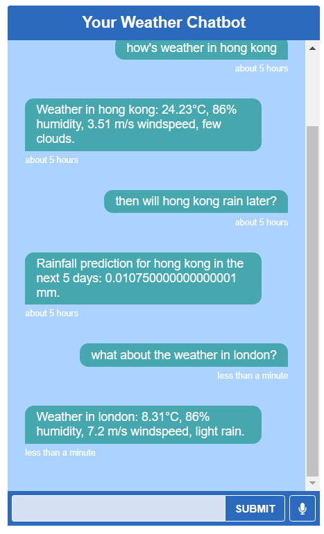

# Introduction
This is a weather chatbot built using Rasa, spacy and openweathermap API. It supports the query of a city's current weather, typhoon signal and rainfall prediction. For example, user can ask "how's the weather in London?", and the chatbot returns the real-time weather information. 

# Setup
## Install Required Dependencies
1. download the `src` folder
2. `pip install rasa, spacy`
3. download the spacy English model with 
`python -m spacy download en_core_web_sm`

## Get your Open Weather API key
1. visit https://openweathermap.org/api
2. register and subscribe to the free version (the code uses weather, rainfall prediction and typhoon signal query only)
3. get your API key
4. go to `src/actions/actions.py` and find `api_key=""`, paste your api key in `""`

## Start Rasa Action Server
1. open a terminal in `src`
2. run `rasa run actions` to start the action server

# Interact with the Chatbot
## In Terminal
1. open a terminal in `src`
2. run `rasa shell`


## Through Localhost
### REST API with Postman
1. run `rasa run --enable-api` to start rasa server and expose its REST API
2. install the Postman desktop client https://www.postman.com/
3. set request as POST to url http://0.0.0.0:5005/webhooks/rest/webhook
4. go to `body` menu, select `json`, enter the request in the following format and send
  ```
  {
    "sender": "test_user",
    "message": "How's the weather in Hong Kong?"
  }
  ```
5. the received `json` is the chatbot's response, you can continue the conversation through sending the next message

### React-based Web Chatroom
1. download the repository https://github.com/scalableminds/chatroom to a folder **outside** `src`
2. in the `chatroom` folder, run `yarn install` 
  - *if you encounter Python error, try (a) install Python 2.7 using Anaconda (b) run `npm config set python "path\to\python2.7\Python.exe"`*
  - *if you encounter MSBuild error, try to remove `node-sass` from `package.json`*
  
3. in `src` directory, run `rasa run --enable-api --cors "*"` to start rasa server and expose its REST API
4. in the `chatroom` folder, run `yarn build` and `yarn serve`
5. visit `http://localhost:8080/index.html` to interact with the chatbot



*you may customize the chatbot color scheme and appearance in `chatroom/src/Chatroom.scss`*
